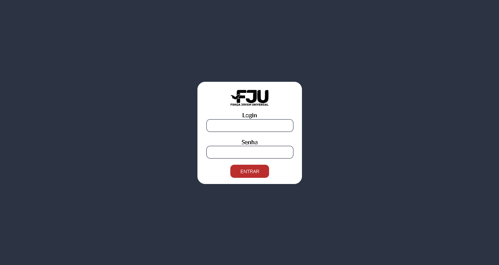
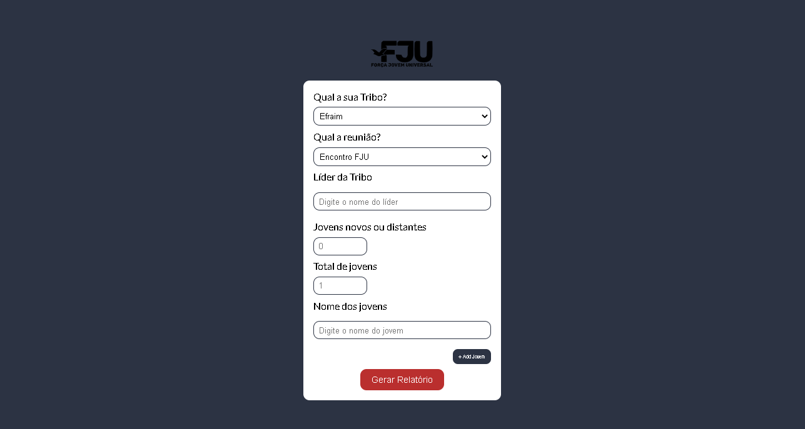

# FJU CONTROLLER APP

This is a private WebApp cretedd as volunteering

Obs: Discontinued project 

## Table of contents

- [Overview](#overview)
  - [The challenge](#the-challenge)
  - [Screenshot](#screenshot)
  - [Links](#links)
- [My process](#my-process)
  - [Built with](#built-with)
  - [What I learned](#what-i-learned)
  - [Continued development](#continued-development)
  - [Useful resources](#useful-resources)
- [Author](#author)
- [Acknowledgments](#acknowledgments)

## Overview

A Web App created to fill informations about present and absent preople considering days and groups.

### The challenge

Users should be able to:

- View the optimal layout for the app depending on their device's screen size
- See hover states for all interactive elements on the page
- Select, submit and generate a report.

### Screenshot

### Links
- Live Site URL: [https://fju-controller-app.vercel.app/](https://fju-controller-app.vercel.app/)

## My process

- Created the UI first and then the logical part of the application.

### Built with

- Flexbox
- Mobile-first workflow
- [React](https://reactjs.org/) - JS library
- [Styled Components](https://styled-components.com/) - For styles
- [React Hook Form](https://react-hook-form.com/) - For deal with Form data

### What I learned

I've learned how to give dinamical functionality to button and create elements with it. I was able also to create validations methods for login and password.

## Author

- GitHub - [Jhonatta Silva](https://github.com/Jhonattasilva2)
- LinkedIn - [JhonattaSilva](https://www.linkedin.com/in/jhonatta-silva-dev/)

## Acknowledgments

I would like to thank @roger777 for give me inspiration to construct this project for help a social group.

